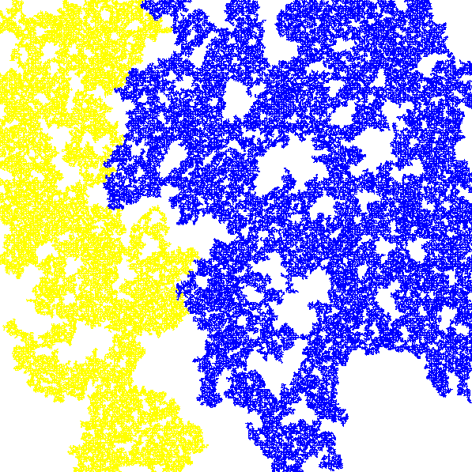

# Week 1 report
### Lars Arie Grit, IT201
___

## Assignment 1.1 ThreeSum
### Assignment steps:
- Run Threesum.java with the 1Kints, 2Kints .. 32Kints data files from the book site. The algs4.jar is here.
- How long does it take on your pc? Use the algs4 Stopwatch class as timer to print a table. Stop when it takes more than 30minutes to save energy, the earth and your patience.
- Use the threesumFAST approach to solve the same data files and analyse the differences in speed. What is the time complexity in Big-O notation and why is this so much faster?

<br>

### Setup process
I have created a seperate project inside of the week1 folder for ThreeSum programs.
Using the online book site I've downloaded all of the assets I need. The [ThreeSum Algoritms](https://algs4.cs.princeton.edu/code/) and although not necessary also the [data files](https://algs4.cs.princeton.edu/code/algs4-data.zip) which I had seperated the necessary files and put it in the assets folder.

Last but certainly not least I had to download the [algs4.jar library](https://algs4.cs.princeton.edu/code/algs4.jar) which I added as a module dependency in intellij, this file is stored in the lib folder in the src.

<br>

### Running the files

After importing the library, changing the import on both ThreeSum and ThreeSum files I can start running the files and giving one of the mints files as arguments.

<br>

#### 1Kints.txt
*ThreeSum output:*
```
elapsed time = 0.196
```
*ThreeSumFast output:*
```
elapsed time = 0.024
```

<br>

#### 2Kints.txt
*ThreeSum output:*
```
elapsed time = 2.392
```
*ThreeSumFast output:*
```
elapsed time = 0.074
```

<br>

#### 4Kints.txt
*ThreeSum output:*
```
elapsed time = 16.472
```
*ThreeSumFast output:*
```
elapsed time = 0.295
```

<br>

#### 8Mints.txt
*ThreeSum output:*
```
elapsed time = 139.752
```
*ThreeSumFast output:*
```
elapsed time = 1.507
```

<br>

When we analyse the outputs it's clear that ThreeSumFast is significantly quicker. Lets take a look at both count functions.

<br>

*ThreeSum*

```java
public static int count(int[] a) {
    int n = a.length;
    int count = 0;
    for (int i = 0; i < n; i++) {
        for (int j = i+1; j < n; j++) {
            for (int k = j+1; k < n; k++) {
                if (a[i] + a[j] + a[k] == 0) {
                    count++;
                }
            }
        }
    }
    return count;
}
```

ThreeSum uses a triple nested loop to iterate through all posibilities.

<br>

*ThreeSumFast*
```agsl
public static int count(int[] a) {
    int n = a.length;
    Arrays.sort(a); // O(n log n)
    int count = 0;
    for (int i = 0; i < n; i++) {
        for (int j = i+1; j < n; j++) {
            int k = Arrays.binarySearch(a, -(a[i] + a[j])); // O(log n)
            if (k > j) count++;
        }
    }
    return count;
}
```

ThreeSumFast sorts the array and then uses a binary search to find the third element in each combination. In short this saves us one iteration in the time complexity.

<br>

The ThreeSumFast algorithm is faster than ThreeSum because it takes advantage of sorting and binary search, which significantly reduces the time complexity.
Sorting the array allows for more efficient searching of elements, resulting in a time complexity of O(n^2 log n) compared to the cubic time complexity of O(n^3) in the case of ThreeSum.
The reduction in time complexity becomes more pronounced as the size of the input array increases, making ThreeSumFast more scalable and efficient for large datasets.


___

## Assignment 1.2 Percolation simulation
### Assignment steps:
Do the Test Exam 4 percolation matrix on DLO (solution main code is given) and explain how it works in your own words.
Create a visualisation to show the two leaking flows from top to bottom (see below).
You can use anything you want to draw bit the Draw class is available in the algs4 library to use.
Choose a smaller grid size than 1000x1000 to create a nice colourful picture.

<br>

### How it works
This Java code simulates percolation on a 2D grid and identifies connected regions. The code simulates percolation on a 2D grid, marks connected regions using depth-first search, and visually displays the identified regions on the grid. The solutions are identified by finding the color markers that percolate from the top row to the bottom row.

### Visualizationss
