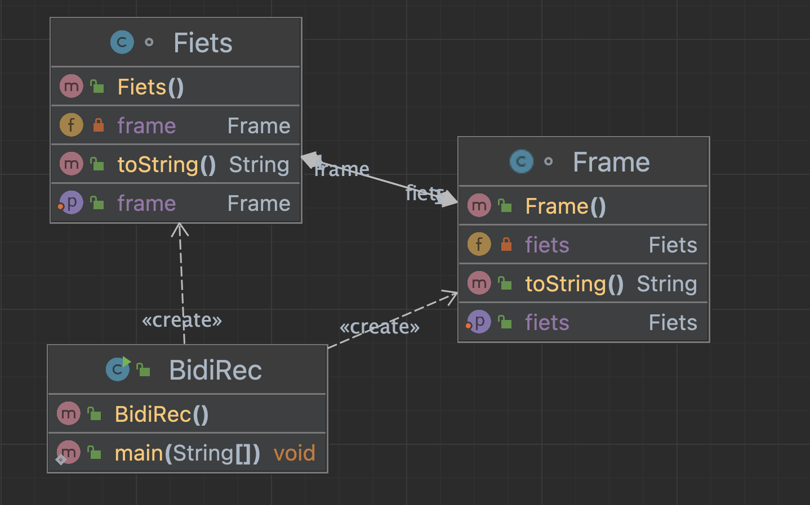

# Week 2 report
### Lars Arie Grit, IT201
___

## Assignment 2.1 parallel sort research
### Assignment steps:
- Create a test program that generates N random numbers or strings and sorts them serial and parallel and show the elapsed time results in a table to show the differences.
- Estimate the break-even point for N where both methods are equaly fast.
- Depending on your pc/laptop you can use more cores to do parallel sort. How many times faster is parallel sort for 200000000 (2E8) numbers? And 600000000 (6E8) ? Note: maybe change the Heap Size of the JVM memory to 8GB if you can:

- Is oege.ie.hva.nl faster in both normal and parallel sorts than your laptop? Why?
Note: learn to use the (putty) commandline and javac + java commandline tools. You do not need the Algs4.jar for this example - use the standard Java sorting methods.
- How long does this take using python list.sort() to sort 200 million items in a list and is Python faster than Java?

<br>

### Setup process
I have created a file called ParallelSortingResearch which has a main function and a generateRandomIntegers function, in the main function we assign a variable called N a integer value, currently 1000000. This value is given to the generateRandomIntegers which creates a randomly generated array of integers, we make sure to create a copy of this generated array and process them both serially and parallel and record their time which we then later print.

### Running the files
Simply run the file

### Questions:
#### Estimate the break-even point for N where both methods are equaly fast.
During testing I have found out that bewloe N = 1000, serial was faster and above 1000 parallel was faster. 1000 was roughly the break-even point. Considering there can be a bit of randomness with the generated array.

#### Depending on your pc/laptop you can use more cores to do parallel sort. How many times faster is parallel sort for 200000000 (2E8) numbers? And 600000000 (6E8) ?

parallel sort for 200000000 (2E8) = Parallel Sort Elapsed Time: 4606 milliseconds

parallel sort for 600000000 (6E8) = Parallel Sort Elapsed Time: 1077 milliseconds

#### Is oege.ie.hva.nl faster in both normal and parallel sorts than your laptop? Why?

It is slower because it uses less cores.

#### How long does this take using python list.sort() to sort 200 million items in a list and is Python faster than Java?

I have created a pythonSort.py program to calculate the time it takes to sort 200 million items using list.sort(). 

##### Python
Parallel Sort Elapsed Time: 23.78267216682434 seconds 
##### Java
Parallel Sort Elapsed Time: 21683.888912200928 milliseconds

---

## Assignment 2.2 the Comparator Class and stable sort
### Assignment steps:
- Is sorting objects more difficult than primitive types like double and int?
- Create a list of N (as large as you can) random objects of some class (Point2D, Date or your own class) and sort it as quick as you can.
Can you verify that the used sorting method is a STABLE sort? (learn what this means!).
Describe your findings and use comments in your code and report.

Note: study the Comparator interface class and learn to use this to sort objects.

Example:

```java
Point2D points[] = new Point2D[1000]; 
Arrays.sort(points, Comparator.comparingDouble(Point2D::getX));  // als je java.awt.geom.Point2D gebruikt of
Arrays.sort(points, Comparator.comparingDouble(Point2D::x)); // bij gebruik van de edu.princeton.cs.algs4.Point2D klasse
```
<br>

### Setup process
I created a Comparator file, this file uses lists and the date function to create a heap of Date objects. The code checks if the sorting is stable by iterating through the sorted list of Date objects and comparing each pair of adjacent dates. It then prints out of the sorting is true or false.

### Running the files
Simply run Comparator.java

```bash
javac Comparator.java
java Comparator
```

### Questions:
#### Is sorting objects more difficult than primitive types like double and int?

Yes. Sorting objects in Java is more dificult than sorting primitive types like double and int. This is because primitive types have a natural ordering, while objects do not.


---

## Assignment 2.3 Recursive Association experiment
### Assignment steps:
You should know how OO relations like inheritance and associations are used in Java, and how toString() overloading from the Object class works (year 1 Java).
Explain what is wrong with this program and generate a UML diagram with IntelliJ to illustrate the problem in your readme.md report.
Where and why does a Stackoverflow occur? Is this a recursive program?

```java
class Fiets {
    private Frame frame = null;
    private String naam = "een fiets ding";

    public void setFrame(Frame frame) {
        this.frame = frame;
    }

    @Override
    public String toString() {
        System.out.println("hi from Fiets toString!");
        return "Fiets{ frame=" + frame + ", naam='" + naam + "'}";
    }
}

class Frame {
    private Fiets fiets = null;
    private String naam = "een frame ding";

    public void setFiets(Fiets fiets) {
        this.fiets = fiets;
    }

    @Override
    public String toString() {
        System.out.println("hi from Frame toString!");
        return "Frame{fiets=" + fiets + ", naam='" + naam + "'}";
    }
}

public class BidiRec {
    public static void main(String[] args) {
        Fiets fiets = new Fiets();
        Frame frame = new Frame();
        fiets.setFrame(frame);
        frame.setFiets(fiets);
        System.out.println(fiets);  // why does it fail here??
    }
}
```
<br>

### Setup process
I created a Comparator file, this file uses lists and the date function to create a heap of Date objects. The code checks if the sorting is stable by iterating through the sorted list of Date objects and comparing each pair of adjacent dates. It then prints out of the sorting is true or false.

### Running the files
Simply run Comparator.java

```bash
javac Comparator.java
java Comparator
```

### Questions:
#### Explain what is wrong with this program and generate a UML diagram with IntelliJ to illustrate the problem in your readme.md report.



#### Where and why does a Stackoverflow occur? Is this a recursive program?

The BidiRec class calls for "fiets" in the println where class Fiets calles for "frame" in it's println, where Frame class calls for "Fiets" in it's println. This creates a stackoverflow and the code gets stuck in an endless loop.

