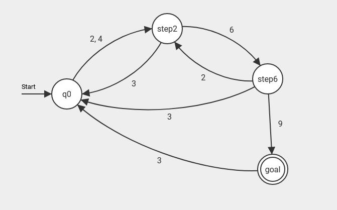
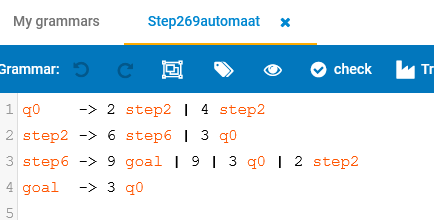
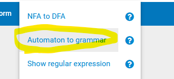
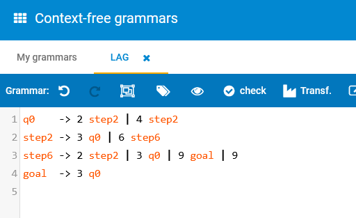

# Week 5 report
### Lars Arie Grit, IT201
___

## Assignment 5.1
### Assignment steps:
- Look at the first example in puzzle https://adventofcode.com/2020/day/19 
- We will solve the example using Flaci.com (no code needed)
- The grammar of the advent2020 puzzle example to copy+paste into a flaci grammar to test looks like this nonterminals must be capitals in Flaci and rules must not end with a semi-colon. Paste these rules in a context-free grammar in flaci.com by selecting grammar and click the plus sign in the bottom right corner:
<br>

### Questions:
#### What is the shortest and the longest word this grammar will accept?
The words always have to be 6 characters long, start with an A and end with a B.

---

## Assignment 5.2 step269 automata.
### Assignment steps:
- Create a Java program that uses regexp to match all inputs that this NDA automaton accepts:
- First use Flaci.com to convert this automata to a regexp and then use the Java.util.regex package Pattern class to match different test inputs.
Use at least 10 different test strings in your code to test the regex. Show that 4693469 is a valid input as well as 269.
Show a picture of your version of the Flaci automaton in the report.


### Setup process
I have created a program called StepAutomata which tests 10 different strings with the regex and checks if it is invalid or valid

### Running the files
Simply run StepAutomata.java

```bash
javac StepAutomata.java
java StepAutomata
```

### Code
```java
import java.util.regex.Matcher;
import java.util.regex.Pattern;
public class StepAutomata {
    public static void main(String[] args) {
        // Define the regular expression
        String regex = "((2|4)(32|34)*6((2|32|34)(32|34)*6)*9|(2|4)(32|34)*6((2|32|34)(32|34)*6)*9((32|34)+6((2|32|34)(32|34)*6)*9)*)";

        // Create a Pattern object
        Pattern pattern = Pattern.compile(regex);

        // Test strings
        String[] testStrings = {
                "2326323469",
                "4234346",
                "246",
                "32346",
                "4693469",
                "269",
                "2469",
                "23234692346",
                "2432469",
                "232346969",
        };

        // Match each test string against the pattern
        for (String testString : testStrings) {
            Matcher matcher = pattern.matcher(testString);
            boolean isMatch = matcher.matches();
            System.out.println(testString + ": " + (isMatch ? "Valid" : "Invalid"));
        }
    }
}
```
### Flaci Automation


---

## Assignment 5.3 parsers and BNF.
### Assignments steps:
- Regular languages are not as powerfull as context-free (BNF) languages.
- Do some research into the differences between Regex and ContextFree Grammars and how you could create a parser that implements the step269 automaton by using the grammar as definition. In most cases you will find that you need a "recursive descent parser" to handle non-regular languages. Tools like ANTLR can generate the code for that, but there are many other options like JAVACC.
- You don't need to build the parser if you can't (using ANTLR can be hard).
- At least describe what a parser, scanner, parstree and grammer is and show a (Flaci generated) parse tree of the step269-automaton looks like. Generate a grammar via Convert -> Automaton to Grammar:
- Note that this is a simple regular language. Can you tell the difference between a regular grammar and a CF grammar?
- Write your research using 200 - 1000 words in markdown format (excluding references). Dutch is OK if you want to use that.






- Note: BNF grammars are everywhere, like in the Python tutorial: https://docs.python.org/3/reference/introduction.html#notation


# Report

## Regular Languages vs Context-Free Languages: A Comparative Analysis

### Introduction

Regular languages and context-free languages are two fundamental concepts in the field of formal languages and automata theory. While regular languages can be described by regular expressions, context-free languages are defined by context-free grammars (CFGs). In this research, we will explore the key differences between regular expressions and context-free grammars, delve into the concept of the step269 automaton, and discuss parser-related terms such as parser, scanner, parse tree, and grammar.

### Regular Languages and Regular Expressions

A regular language can be described by a regular expression, which is a concise way of representing a set of strings. Regular expressions are powerful for recognizing patterns in strings, but they have limitations in expressing nested or recursive structures. Regular languages are those that can be recognized by finite automata, and they are closed under union, concatenation, and Kleene closure operations.

Regular expressions are suitable for simple pattern matching, such as validating email addresses or matching phone numbers in a text. They are not well-suited for handling more complex structures that involve nested or recursive patterns.

### Context-Free Languages and Context-Free Grammars

Context-free languages, on the other hand, are described by context-free grammars. Context-free grammars provide a more expressive way to define languages by allowing for nested and recursive structures. A context-free grammar consists of production rules that specify how symbols can be replaced by sequences of other symbols.

Context-free languages are more powerful than regular languages and are capable of representing a broader range of structures. They are widely used in the specification of programming languages, where the hierarchical nature of code requires a more sophisticated language structure than what regular languages can provide.

### The Step269 Automaton

The step269 automaton is a specific type of automaton designed to recognize patterns that are not expressible using regular expressions alone. It is particularly useful for handling non-regular languages. The step269 automaton is more powerful than finite automata, which can only recognize regular languages.

To implement a parser using the step269 automaton, one would typically use a recursive descent parser. Recursive descent parsers are top-down parsers that follow the structure of the grammar being parsed. They are suitable for context-free grammars and can handle languages with nested and recursive constructs.

### Tools for Implementing Parsers

Several tools facilitate the implementation of parsers for context-free grammars. ANTLR (ANother Tool for Language Recognition) and JavaCC are popular parser generators that can automatically generate code for parsers based on a given grammar. These tools are especially helpful for handling complex languages with intricate syntax.

ANTLR, for instance, supports the definition of grammars in Extended Backus-Naur Form (EBNF) notation, making it a powerful tool for working with context-free grammars. JavaCC, on the other hand, generates Java code for parsers based on JavaCC grammar specifications.

### Parser, Scanner, Parse Tree, and Grammar

- **Parser:** A parser is a component of a compiler or interpreter that processes the input code according to a given grammar. It analyzes the syntactic structure of the code and generates a parse tree.

- **Scanner:** Also known as a lexer, a scanner is responsible for breaking the input code into tokens. Tokens are the smallest units of meaning in a programming language.

- **Parse Tree:** A parse tree is a hierarchical representation of the syntactic structure of the input code. It is generated by the parser and serves as an intermediate step before generating the Abstract Syntax Tree (AST).

- **Grammar:** In the context of formal languages, a grammar is a set of production rules that define the syntax of a language. It specifies how sentences in the language can be formed from basic elements.

### Regular Grammar vs Context-Free Grammar

The key difference between a regular grammar and a context-free grammar lies in the expressive power. Regular grammars are limited to representing regular languages, which are less expressive compared to context-free languages. Context-free grammars can describe languages with nested and recursive structures, making them more suitable for representing the syntax of programming languages.

